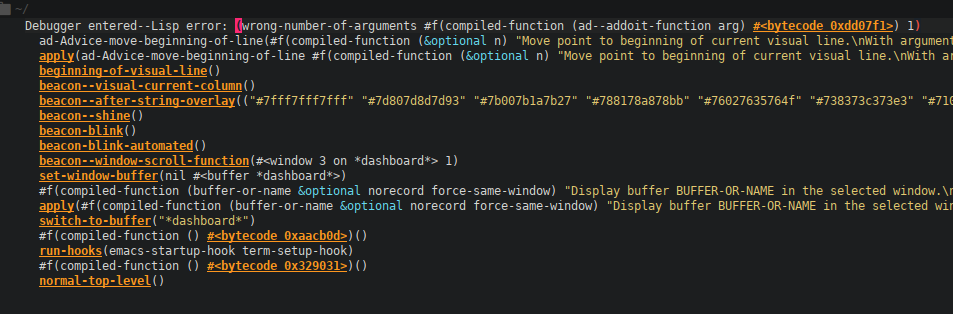

# Emacs

## Org 시작하기
[Org-mode 기초부터 시작하기](https://edykim.com/ko/post/start-with-orgmode-basics/)

## Javascript
[Using React in Emacs](https://emacs-lsp.github.io/lsp-mode/tutorials/reactjs-tutorial/#installing-the-typescript-language-server)

## Git Document
[Dotfiles](http://ivanmalison.github.io/dotfiles/)  
[Emacs Siren](https://github.com/jimeh/.emacs.d)  
[Personal GNU Emacs configuration](https://github.com/rememberYou/.emacs.d)  
[More Productive With Emacs](https://github.com/pprevos/EmacsLife)

## Blog
[Living an Awesome Life](https://sachachua.com/blog/)  
[Emacs Config](https://jamiecollinson.com/blog/my-emacs-config)  
[A year with Emacs](http://frostyx.cz/posts/a-year-with-emacs)   
[Goodbye VSCode, Hello Emacs (Again)](https://hotair.tech/blog/goodbye-vscode)  

## Changes

 갑자기 에러가 발생해서 에러가 발생하는 패키지만 일단 제거  
 추후에 문법에러를 살펴보기로 한다  

